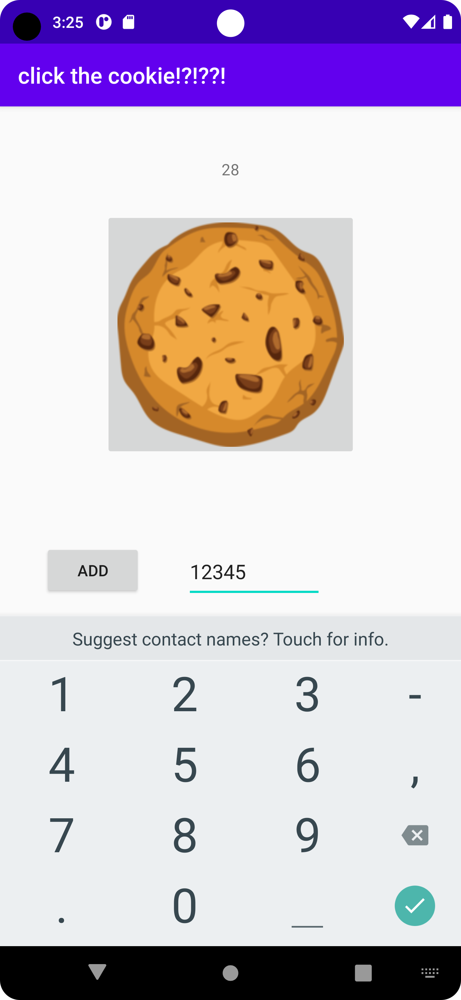
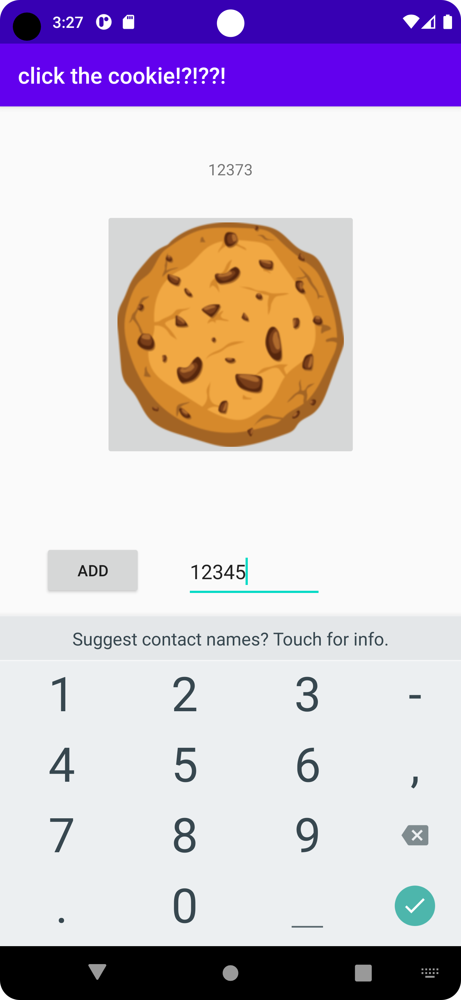

# Rapport

började med att lägga till några views i activity_main.xml men det ändrades senare 
```
    <TextView
        android:id="@+id/textView"
        android:layout_width="wrap_content"
        android:layout_height="wrap_content"
        android:text="Hello World!"
        android:text="cookies: 0"
        app:layout_constraintBottom_toBottomOf="parent"
        app:layout_constraintLeft_toLeftOf="parent"
        app:layout_constraintRight_toRightOf="parent"
        app:layout_constraintTop_toTopOf="parent" />
        app:layout_constraintTop_toTopOf="parent"
        app:layout_constraintVertical_bias="0.064" />

    <ImageButton
        android:id="@+id/imageButton"
        android:layout_width="wrap_content"
        android:layout_height="wrap_content"
        android:layout_marginTop="28dp"
        app:layout_constraintEnd_toEndOf="parent"
        app:layout_constraintStart_toStartOf="parent"
        app:layout_constraintTop_toBottomOf="@+id/textView"
        app:srcCompat="@drawable/cookie" />

    <Button
        android:id="@+id/button3"
        android:layout_width="wrap_content"
        android:layout_height="wrap_content"
        android:layout_marginTop="56dp"
        android:text="add auto clicker"
        app:layout_constraintEnd_toEndOf="parent"
        app:layout_constraintStart_toStartOf="parent"
        app:layout_constraintTop_toBottomOf="@+id/imageButton" />
```

skapade sedan funktioner för allting
```
public void onImageButtonClicked(View view) {
        // get the current value of the counter
        TextView TextView = (TextView ) findViewById(R.id.textView);
        String counterString = TextView.getText().toString();
        int counter = Integer.parseInt(counterString);
        // increment the counter
        counter++;
        TotalCookies++;
        // display the new value of the counter
        TextView.setText(Integer.toString(counter));
    }

    // when the noraml button is pressed remove 20 from the counter and add 1 cookie every second
    public void onNormalButtonClicked(View view) {
        if (TotalCookies >= 20) {
            // get the current value of the counter
            TextView TextView = (TextView ) findViewById(R.id.textView);
            String counterString = TextView.getText().toString();
            int counter = Integer.parseInt(counterString);
            // decrement the counter by 20
            counter -= 20;
            TotalCookies -= 20;
            // display the new value of the counter
            TextView.setText(Integer.toString(counter));
            // add 1 cookie every second
            addPerSecond++;
        }
    }

    // create a thread that adds addPerSecond cookies every second
    public void run() {
        while (true) {
            try {
                Thread.sleep(1000);
            } catch (InterruptedException e) {
                e.printStackTrace();
            }
            // get the current value of the counter
            TextView TextView = (TextView ) findViewById(R.id.textView);
            String counterString = TextView.getText().toString();
            int counter = Integer.parseInt(counterString);
            // increment the counter
            counter += addPerSecond;
            TotalCookies += addPerSecond;
            // display the new value of the counter
            TextView.setText(Integer.toString(counter));
        }
    }
```

sedan så flyttades run till en egen thread class som jag kallade för cookieCounter, men efter en stund så märkte jag att den inte fungerade som jag ville och jag hade inte tid att fixa detta så jag ändrade automatiska kakor till att man kan manuellt lägga till så många kakor man vill.

```
    <EditText
        android:id="@+id/editTextNumber"
        android:layout_width="123dp"
        android:layout_height="51dp"
        android:layout_marginTop="76dp"
        android:layout_marginEnd="84dp"
        android:layout_marginRight="84dp"
        android:ems="10"
        android:inputType="number"
        app:layout_constraintEnd_toEndOf="parent"
        app:layout_constraintHorizontal_bias="0.5"
        app:layout_constraintStart_toEndOf="@+id/button"
        app:layout_constraintTop_toBottomOf="@+id/imageButton" />

    <Button
        android:id="@+id/button3"
        android:id="@+id/button"
        android:layout_width="wrap_content"
        android:layout_height="wrap_content"
        android:layout_marginTop="56dp"
        android:text="add auto clicker"
        app:layout_constraintEnd_toEndOf="parent"
        android:layout_marginTop="76dp"
        android:text="add"
        app:layout_constraintEnd_toStartOf="@+id/editTextNumber"
        app:layout_constraintHorizontal_bias="0.5"
        app:layout_constraintStart_toStartOf="parent"
        app:layout_constraintTop_toBottomOf="@+id/imageButton" />
```

samt lade till funktionaliteten för detta.
```
    // when normal button is clicked, add the value in the edit text to the counter and display the new value
    public void onButtonClicked(View view) {
        // get the current value of the counter
        TextView TextView = findViewById(R.id.textView);
        String counterString = TextView.getText().toString();
        int counter = Integer.parseInt(counterString);

        // get the value in the edit text
        TextView EditText = findViewById(R.id.editTextNumber);
        String editTextString = EditText.getText().toString();
        int editText = Integer.parseInt(editTextString);

        // add the value in the edit text to the counter
        counter += editText;

        // display the new value of the counter
        TextView.setText(Integer.toString(counter));
    }
```

och lade till listeners till knapparna
```
Button button = findViewById(R.id.button);
        ImageButton CookieButton = findViewById(R.id.imageButton);


        // listeners
        CookieButton.setOnClickListener(new View.OnClickListener() {
            // when image button is clicked, take the current value of the counter and increment it by 1 and display the new value
            @Override
            public void onClick(View v) {
                onImageButtonClicked(v);
            }
        });
        button.setOnClickListener(new View.OnClickListener() {
            // when normal button is clicked, add the value in the edit text to the counter and display the new value
            @Override
            public void onClick(View v) {
                onButtonClicked(v);
            }
        });
```

bilder på programmet:

